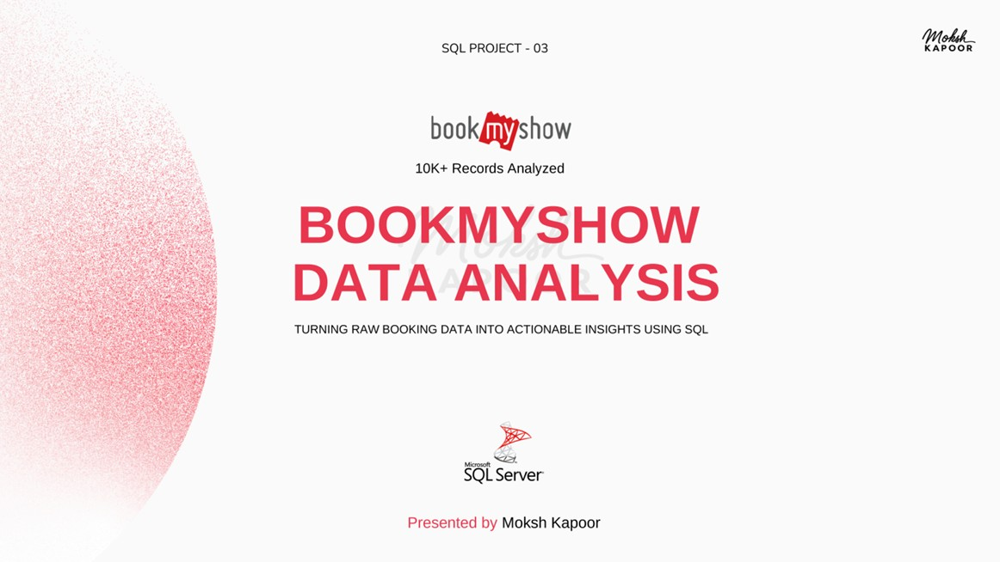

# 🎬 BookMyShow Booking & Revenue Analytics | SQL Project

An end-to-end **SQL analytics project** analyzing a simulated **BookMyShow-style movie ticket booking system** using a relational database with **9 interconnected tables** and **10K+ rows per table**.

This project focuses on booking behavior, movie performance, theater analytics, payment success rates, and revenue trends using advanced SQL queries and KPI-driven analysis.

---

# 📊 Project Preview

### 🎥 Workings of Bank Loan Portfolio Risk & Performance Analysis Project (SQL)

📌 Click on the image to see the working of this project as a presentation  

## 📺 SQL Analysis Preview

[](https://www.linkedin.com/posts/moksh-kapoor-618495322_bookmyshow-data-analysis-sql-project-activity-7444966779556274176-ljZu?utm_source=share&utm_medium=member_desktop&rcm=ACoAAFGVzjQBQzKnpNzkuOZayyyvYW4FkHnrf28)

---

## 🧩 Data Model

[](https://www.linkedin.com/posts/moksh-kapoor-618495322_bookmyshow-data-analysis-sql-project-activity-7444966779556274176-ljZu?utm_source=share&utm_medium=member_desktop&rcm=ACoAAFGVzjQBQzKnpNzkuOZayyyvYW4FkHnrf28)


---

# 📁 Dataset Overview

This project analyzes a **BookMyShow booking dataset** containing transactional booking information across:

- Users  
- Movies  
- Theaters  
- Screens  
- Shows  
- Seats  
- Cities & States  
- Bookings  
- Payments  

The dataset simulates a real-world movie ticket booking platform with complex transactional workflows including:

- Seat allocation  
- Booking confirmation  
- Payment attempts  
- Revenue generation  
- Failed & invalid transactions  

A consolidated analytical layer was created by joining all 9 tables for scalable KPI analysis.

---

# 🧱 Data Modeling & ER Diagram

A structured relational data model was designed using:

- Primary & Foreign Keys
- One-to-Many relationships
- Transactional booking flow mapping

### Core Relationships

- User → Booking → Payment
- Movie → Show → Theater
- Screen → Seat → Booking
- Theater → City → State

The ERD helped create a scalable SQL analysis layer for business reporting and KPI tracking.

---

# 🧪 Data Cleaning & EDA

SQL-based exploratory analysis was performed to validate dataset quality before KPI generation.

### Key Validation Steps

- Checked NULL values & blanks
- Validated payment & booking statuses
- Verified relationship consistency
- Standardized categorical values
- Ensured date & revenue accuracy
- Removed orphan transaction records

This ensured reliable business reporting and accurate KPI calculations.

---

# 🎯 Business Problem & Analysis

Movie ticket platforms need visibility into:

- Revenue performance
- Booking trends
- Payment failures
- Theater occupancy
- User engagement
- Movie demand patterns

This project transforms raw transactional booking data into actionable insights for operational optimization and revenue growth.

---

# 📊 KPI Framework

| KPI | Description |
|---|---|
| Total Revenue | Overall revenue generated |
| Total Bookings | Total tickets booked |
| Booking Success Rate | Successful booking percentage |
| Failed Booking Rate | Failed & invalid booking % |
| Average Booking Value | Avg revenue per booking |
| Monthly Active Users | Monthly user activity |
| Repeat Customer Rate | Returning user contribution |
| Revenue Loss | Revenue lost due to payment failures |
| MoM Revenue Growth | Month-over-Month growth |
| YoY Booking Growth | Year-over-Year growth |

---

# 📌 Analysis Categories

## 👥 User Behavior & Engagement

- Repeat customer analysis
- Booking behavior by age group
- Weekend vs weekday trends
- Peak booking hours
- Revenue contribution by user type

---

## 🎥 Movie Performance Analysis

- Top movies by revenue & bookings
- Genre-wise performance
- Language-wise contribution
- Occupancy analysis
- Multi-city performance tracking

---

## 🏢 Theater & Show Analysis

- Theater revenue comparison
- City & state engagement
- Show timing performance
- Premium seat occupancy
- Screen utilization trends

---

## 💳 Payment & Transaction Analysis

- Payment success vs failure rate
- Failed & invalid transactions
- Revenue leakage analysis
- Payment method comparison
- MoM failure trends

---

# 🛠️ SQL Concepts & Techniques Used

## 🔹 SQL Features Used

- Complex Multi-Table Joins
- CTEs (Common Table Expressions)
- Window Functions
- Aggregations (`SUM`, `AVG`, `COUNT`)
- Conditional Logic (`CASE WHEN`)
- Ranking Functions
- Date Functions
- Revenue Calculations
- Occupancy Metrics
- MoM & YoY Growth Analysis

---

# 📊 Key Insights & Findings

| Insight Area | Finding |
|---|---|
| Booking Demand | Strong seasonal & festive spikes |
| Best Show Timings | Evening & Afternoon shows perform highest |
| Audience Trends | Users aged 50+ contribute major bookings |
| Pricing Impact | Premium pricing lowers occupancy |
| Revenue Concentration | Revenue dominated by top movies & repeat users |
| Geographic Opportunity | High-demand movies under-distributed |
| Payment Risk | Failed transactions cause direct revenue loss |
| Operational Issue | Payment reliability fluctuates monthly |

---

# 💡 Strategic Recommendations

- Align movie releases with seasonal demand peaks  
- Increase screen allocation during high-demand hours  
- Use dynamic pricing for premium seats  
- Expand top-performing movies geographically  
- Improve payment reliability monitoring  
- Build loyalty programs for repeat users  
- Localize payment methods regionally  

---

# 🔍 Key Learnings

Through this project, I improved my skills in:

- Relational Data Modeling  
- SQL Query Optimization  
- Multi-Table Joins  
- KPI Reporting  
- Business Analytics  
- Revenue Analysis  
- Trend Analysis  
- Transaction Analytics  
- Data Cleaning & EDA  

---

# 📂 Repository Structure

```bash
bookmyshow-booking-analysis-sql/
│
├── Datasets/
│   ├── Datasets.rar
│
├── Images/
│   ├── Bookmyshow.jpg
│   ├── Schema.jpg
│   └── Bookmyshow Data Analysis - Moksh Kapoor.pdf
│
├── README.md
```

---

# 👤 Author

## Moksh Kapoor

📊 Aspiring Data Analyst  

### Skills
SQL • Power BI • Excel • Python

🔗 LinkedIn:  
[Visit My LinkedIn Profile](https://www.linkedin.com/in/moksh-kapoor-618495322/)

---

⭐ If you like this project, consider giving it a **star** on GitHub!
